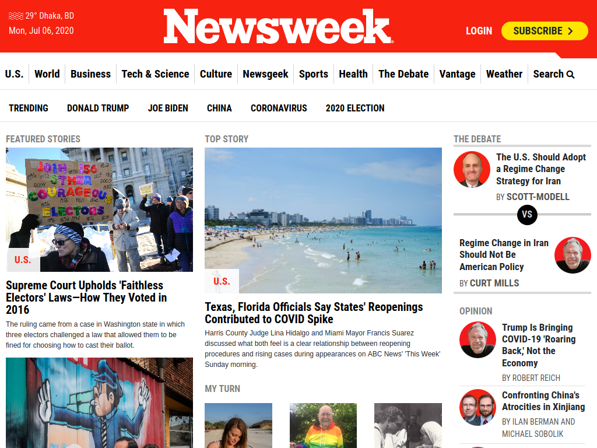
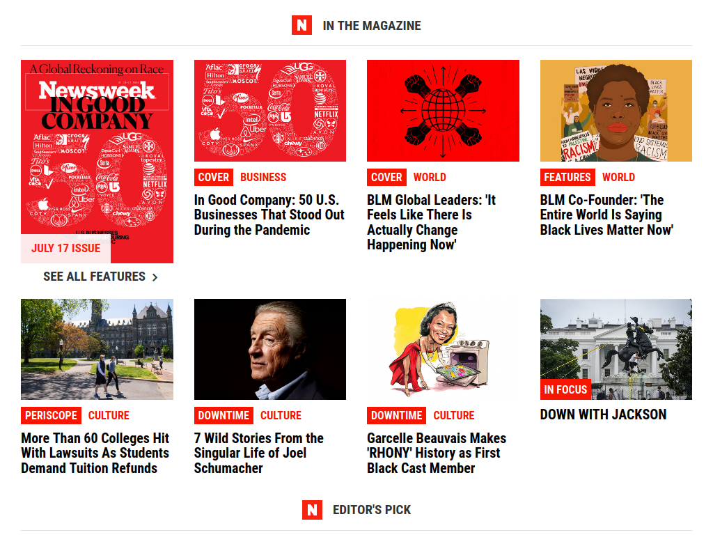
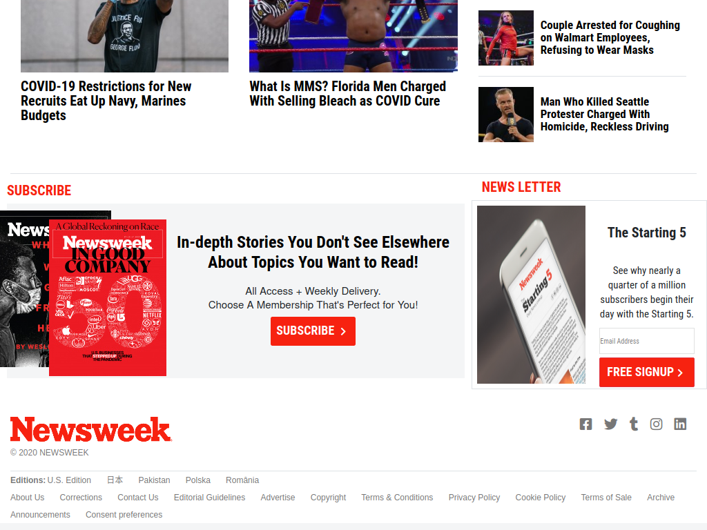
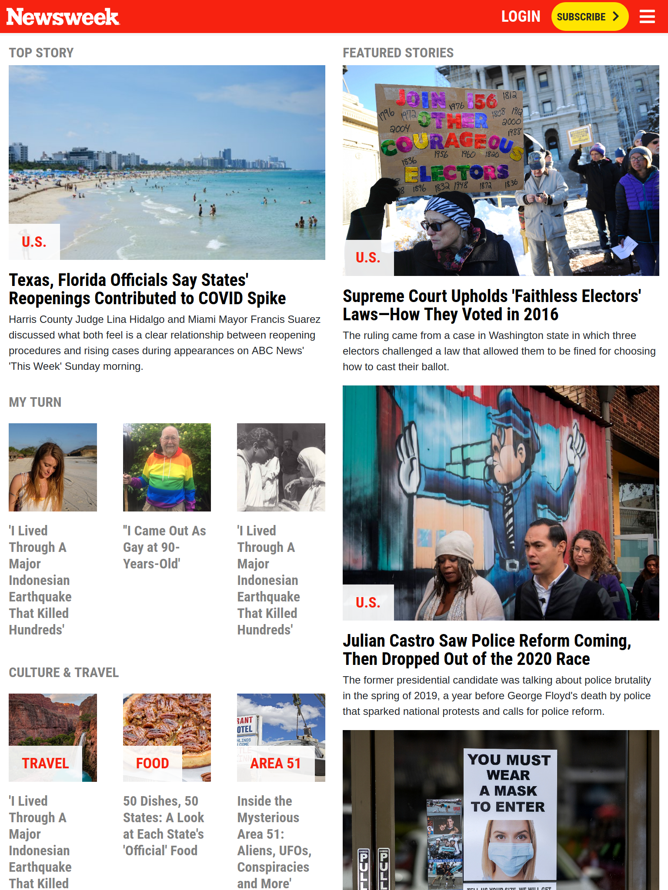
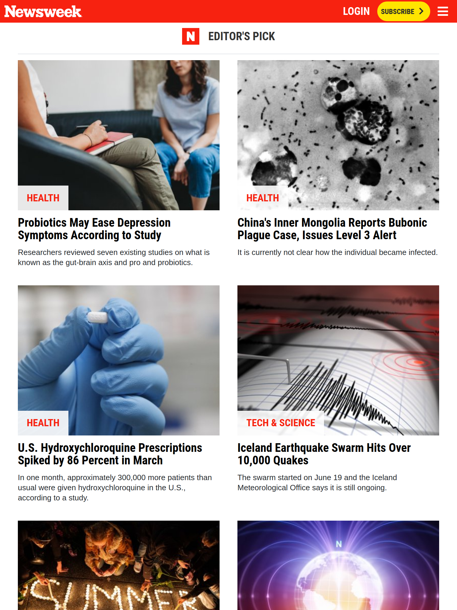
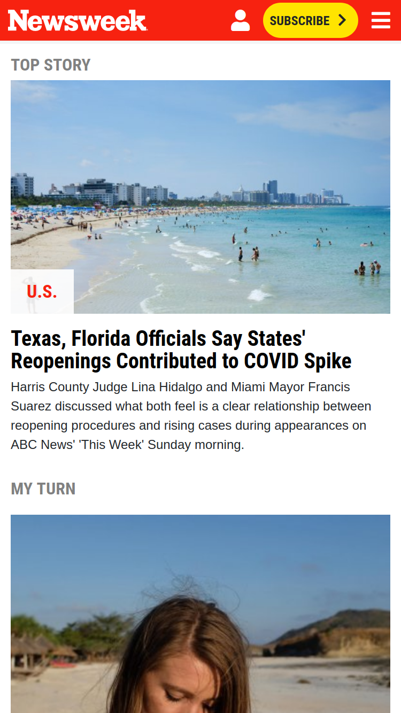
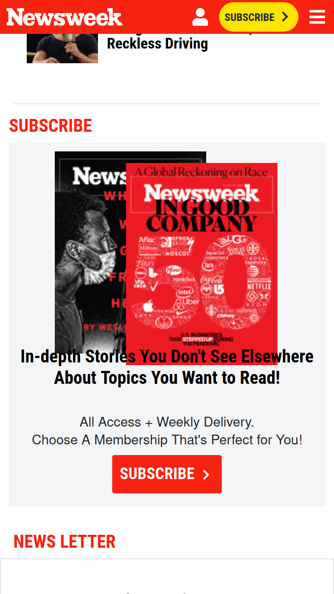
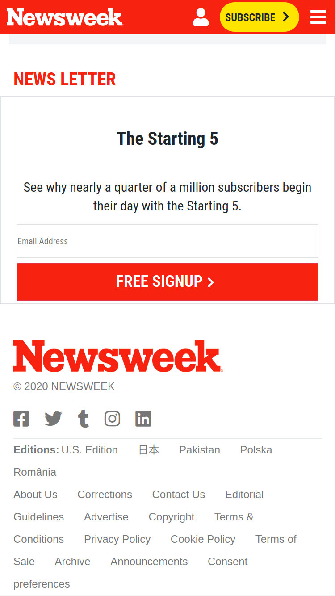

# The NewsWeek Clone  

> For this project, we recreated The Newsweek website with fully responsive web design using bootstrap.

> This Microverse project allowed us to demonstrate the use of media queries to design webpages that adapt to different screen sizes. Also we learned about bootstrap.

**Large Screen (Greater than 1023px)**

**Medium Screen (Greater than 767px)**

**Small Screen (Less than 767px)**

Click [here](https://www.newsweek.com//) to view The NewsWeek website, which we used as a model for this project.

## Built With 🧰

- HTML
- CSS

## Live Demo 🔴

[Live Demo Link](https://dreamy-fermi-2a08f5.netlify.app/ )

## Getting Started 🏁

To get a local copy up and running on your own machine, just follow these simple steps:

### Prerequisites

If you are viewing this README.md file using a computer, a browser and a connection to the internet, then congratulations! You have all the prerequisites to access our project.

### Setup

1. Open Terminal
2. Navigate to your desired location to download the contents of this repository.
3. Copy and paste the following code into the Terminal: 
        
        git clone https://github.com/rloterh/NewsWeekClone.git

4. Hit enter
5. Once the repository has been cloned, open index.html in a browser of your choosing.
6. Enjoy!

## Authors

👤 **Robert Loterh**

- Github: [@rloterh](https://github.com/rloterh)
- Twitter: [@RLoterh](https://twitter.com/RLoterh)
- Linkedin: [Robert Loterh](https://www.linkedin.com/in/robert-loterh-30b265135)
- Email: rloterh@gmail.com

👤 **Ershadul Hakim Rayhan**

- Github: [@ershadul1](https://github.com/ershadul1)
- Twitter: [@ErshadulRayhan](https://twitter.com/ErshadulRayhan)
- Linkedin: [ErshadulRayhan](https://www.linkedin.com/in/ershadul-hakim-rayhan-a5a17649/)
- Email:  ershadul.rayhan@gmail.com

## 🤝 Contributing

The best contribution you can make is helping us improve our work by submitting an issue. 

You can also fork this repo and work on it.

## Show your support

Give a ⭐️ if you like this project!

## Acknowledgments

- [Microverse](https://www.microverse.org/)
- The Newsweek - nice website!
- VSCode <3

## 📝 License

This project is [MIT](lic.url) licensed.
